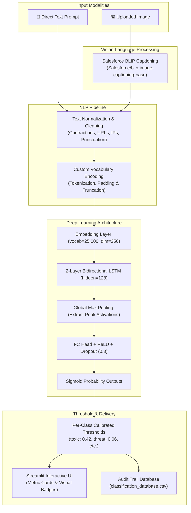

# 🛡️ Multi-Label Toxic Content Moderation System

[](https://www.python.org/)
[](https://pytorch.org/)
[](https://streamlit.io/)
[](https://huggingface.co/)
[](LICENSE)

An end-to-end Deep Learning system designed to identify and classify abusive, harmful, and safety-violating content across text prompts and visual media. The project integrates **Bidirectional LSTM (BiLSTM)** architectures, **Salesforce BLIP** vision-language models for image captioning, and an interactive **Streamlit** dashboard backed by an audit trail database.

---

## 🎯 Project Goals & Motivation

Modern online platforms, forums, and AI assistants (like ChatGPT with Vision or Gemini) face sophisticated toxicity and safety challenges:
1. **Multi-Label Fine-Grained Toxicity**: Toxic expressions rarely belong to a single bucket; an abusive statement can be simultaneously obscene, insulting, and identity-directed. The system accurately predicts 6 distinct toxicity facets.
2. **Cross-Modal / Visual Moderation**: Toxicity is often conveyed visually through images, memes, or screenshots. Using automated image captioning (BLIP), visual inputs are converted to descriptive text and screened using the moderation engine.
3. **Severe Class Imbalance & Real-World Utility**: Real-world toxicity is sparse (categories like `threat` and `identity_hate` represent $<1\%$ of data). The project implements class weighting and per-label threshold calibration to maximize recall on safety-critical classes without flooding false alarms.
4. **Transparent Auditability**: Moderation events, probability scores, and inputs are logged into an audit trail database for review and governance.

---

## 🏗️ System Architecture & Workflow Pipeline



---

## 📁 Repository Structure

```text
.
├── src/                                     # Production application and inference engine
│   ├── app.py                               # Streamlit web interface with interactive tabs
│   ├── model_loader.py                      # BiLSTMToxicityModel architecture & inference pipeline
│   ├── database.py                          # Audit logging engine and CSV database handler
│   ├── imagecaption.py                      # BLIP image caption generation module
│   ├── best_bilstm_LargeSet.pth             # Trained PyTorch checkpoint (Large Dataset)
│   ├── vocab.pkl                            # Serialized vocabulary dictionary
│   └── classification_database.csv          # Persistent audit trail log
│
├── Notebooks/
│   ├── LSTM on large dataset/               # Track 2: 160k-sample Multi-Label Toxicity Project
│   │   ├── Cleaning&Preprocessing.ipynb     # Text preprocessing, vocab generation & BiLSTM training
│   │   ├── EDA_for_Largeset.ipynb           # Distribution, token length & label co-occurrence analysis
│   │   ├── make_sure_no_leakge.ipynb        # Dataset split verification and leakage checks
│   │   ├── test_data_check.ipynb            # Kaggle test evaluation and valid ID filtering
│   │   ├── train.csv / test.csv             # Kaggle Jigsaw Toxic Comment dataset files
│   │   ├── best_bilstm_LargeSet.pth         # Saved weights for large-scale model
│   │   ├── best_bilstm_no_glove.pth         # Ablation checkpoint without GloVe
│   │   └── valid_test_ids.pkl               # Filtered non-(-1) evaluation IDs
│   │
│   └── LSTM/                                # Track 1: Multimodal 9-Category Safety Interaction
│       ├── EDA_2.ipynb                      # Exploratory data analysis for multimodal interactions
│       ├── LSTM_train.ipynb                 # BiLSTM training with synthetic prompt-image boundaries
│       ├── LSTM+pretrained_vector.ipynb     # Transfer learning experiment with GloVe 100d
│       ├── Testing_LSTM.ipynb               # Ad-hoc prompt inference and evaluation
│       ├── cellula toxic data.csv           # Interaction dataset (query + image description)
│       ├── bilstm_toxicity_model.pth        # Saved checkpoint for 9-class safety model
│       └── glove/                           # GloVe 6B word embeddings
│
├── LICENSE                                  # Apache License 2.0
├── README.md                                # Project documentation
└── .gitignore                               # Git ignored files & environments
```

---

## 🧪 Experimental Tracks & Results

The project was executed across two distinct developmental phases:

### 1. Large-Scale Multi-Label Toxicity Classification (Primary Model in `src/`)
Trained on the 160,000-sample Kaggle / Jigsaw Toxic Comment dataset to identify 6 toxicity categories simultaneously:

- **Validation ROC-AUC**: **`0.9680`**
- **Test ROC-AUC**: **`0.9558`**
- **Optimal Decision Thresholds** (calibrated to counter extreme class imbalance):
  | Category | Optimal Threshold | Default Threshold | Motivation |
  | :--- | :---: | :---: | :--- |
  | **`threat`** | **0.06** | 0.50 | Extreme sparsity (<1% of samples); ensures critical threats are not missed. |
  | **`identity_hate`** | **0.15** | 0.50 | High social harm; prioritizing sensitive recall. |
  | **`severe_toxic`** | **0.31** | 0.50 | Captures high-severity toxicity while suppressing noise. |
  | **`toxic`** | **0.42** | 0.50 | High frequency base class; calibrated near parity. |
  | **`insult`** | **0.45** | 0.50 | Balanced precision and recall. |
  | **`obscene`** | **0.49** | 0.50 | High-frequency explicit terms. |

### 2. Multimodal Safety Policy Interaction Classification
Trained on cross-modal user interactions (`query` + `" sep "` + `image descriptions`) across 9 safety categories:
- **Test Weighted F1 Score**: **`0.9465` (94.65%)**
- **Test Accuracy**: **`94.89%`**
- **Minority Class Performance**: Perfect $1.00$ recall achieved on *Child Sexual Exploitation* and *Suicide & Self-Harm*.

---

## 💻 Interactive Streamlit Application

The deployment application in [`src/app.py`](file:///c:/Desktop/desktop/Summer interns/Cellula NLP/Project_1 Toxic text classifications/src/app.py) provides an intuitive, real-time interface:

1. **Direct Text & Image Moderation**:
   - **Text Mode**: Input any comment or prompt to run instant toxicity inference.
   - **Image Mode**: Upload `.jpg`, `.jpeg`, or `.png` images. [`generate_caption`](file:///c:/Desktop/desktop/Summer interns/Cellula NLP/Project_1 Toxic text classifications/src/imagecaption.py#L10-L23) automatically describes the scene using BLIP before passing it to the BiLSTM classifier.
2. **Multi-Label Metric Cards**:
   - Displays real-time status badges (`🚨 TOXIC` vs `✅ CLEAN`) with calibrated percentage confidence scores for each of the 6 classes.
3. **Audit Trail Database Viewer**:
   - Every inference request is persisted to [`classification_database.csv`](file:///c:/Desktop/desktop/Summer interns/Cellula NLP/Project_1 Toxic text classifications/src/classification_database.csv) with timestamp, input type, input text, and predicted labels.
   - Users can inspect and refresh the historical audit log directly from the UI.

---

## 🚀 Quickstart & Setup

### 1. Prerequisites & Environment Setup
Clone the repository and activate your Python virtual environment:
```powershell
git clone <repo-url>
cd "Project_1 Toxic text classifications"

# Activate existing virtual environment (Windows PowerShell)
.\.venv\Scripts\Activate.ps1
```

### 2. Install Required Dependencies
Ensure the necessary packages are installed:
```powershell
pip install torch torchvision transformers streamlit pandas pillow scikit-learn
```

### 3. Launch the Streamlit App
Start the web dashboard:
```powershell
streamlit run src/app.py
```
The app will open automatically in your browser at `http://localhost:8501`.

---


## ⚖️ License

This project is licensed under the [Apache License 2.0](file:///c:/Desktop/desktop/Summer interns/Cellula NLP/Project_1 Toxic text classifications/LICENSE).
└── README.md                   # Project documentation